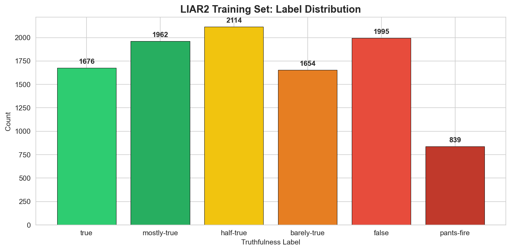

1. Data Loading & Exploration
=============================

Dataset: LIAR2
--------------

The `LIAR2 dataset <https://aclanthology.org/W18-5513/>`_ contains ~23,000
professionally fact-checked political statements from PolitiFact, classified
into 6 truthfulness categories.

**Source files** (in ``data/``):

.. list-table::
   :header-rows: 1
   :widths: 20 15 40

   * - File
     - Samples
     - Purpose
   * - ``train.tsv``
     - 10,240
     - Model training
   * - ``valid.tsv``
     - 1,284
     - Hyperparameter tuning
   * - ``test.tsv``
     - 1,267
     - Final evaluation

Loading Code
------------

.. code-block:: python

   liar2_columns = [
       'id', 'label', 'statement', 'subject', 'speaker', 'job_title',
       'state_info', 'party_affiliation', 'barely_true_count', 'false_count',
       'half_true_count', 'mostly_true_count', 'pants_on_fire_count',
       'context', 'justification'
   ]
   df = pd.read_csv('data/train.tsv', sep='\t', header=None, names=liar2_columns)

Intermediate Output -- Dataset Shape
~~~~~~~~~~~~~~~~~~~~~~~~~~~~~~~~~~~~~

.. code-block:: text

   Dataset shape: (10240, 15)
   Columns: id, label, statement, subject, speaker, job_title,
            state_info, party_affiliation, barely_true_count,
            false_count, half_true_count, mostly_true_count,
            pants_on_fire_count, context, justification

Intermediate Output -- First 3 Rows
~~~~~~~~~~~~~~~~~~~~~~~~~~~~~~~~~~~~~

.. code-block:: text

   label         statement                                             speaker          party
   false         Says the Annies List political group supports...      dwayne-bohac     republican
   half-true     When did the decline of coal start? It started...     scott-surovell   democrat
   mostly-true   Hillary Clinton agrees with John McCain "by vo...     barack-obama     democrat

Missing Values Analysis
-----------------------

.. code-block:: text

                       Missing   Percent
   justification       10240     100.0%    <-- entirely NaN!
   job_title            2898      28.3%
   state_info           2210      21.6%
   context               102       1.0%
   subject                 2       0.0%
   speaker                 2       0.0%
   party_affiliation       2       0.0%

.. warning::

   The ``justification`` column is 100% NaN. This PolitiFact reasoning
   field could significantly boost accuracy if recoverable. Check if
   this is a TSV parsing issue (column count mismatch) or genuinely missing.

Label Distribution
------------------

.. code-block:: text

   half-true       2114  (20.6%)  ########################################
   false           1995  (19.5%)  #######################################
   mostly-true     1962  (19.2%)  ######################################
   true            1676  (16.4%)  ################################
   barely-true     1654  (16.2%)  ################################
   pants-fire       839  ( 8.2%)  ################

   Imbalance ratio (max/min): 2114/839 = 2.52

Text Statistics
---------------

.. code-block:: text

   Character length:  Mean=106.9  Median=93.0  Min=11    Max=3192
   Word count:        Mean=18.0   Median=15.0  Min=2     Max=467

.. image:: ../review_outputs/02_text_statistics.png
   :width: 700
   :alt: Word count distribution

Top Speakers
------------

.. code-block:: text

   barack-obama                        508 statements
   donald-trump                        321 statements
   hillary-clinton                     165 statements
   mitt-romney                         112 statements
   scott-walker                        107 statements
   john-boehner                         96 statements
   rick-perry                           93 statements
   chain-email                          90 statements

Sample Statements
-----------------

.. code-block:: text

   [TRUE]
     Speaker: scott-surovell (democrat)
     "When did the decline of coal start? It started when natural gas took off."

   [PANTS-FIRE]
     Speaker: blog-posting (none)
     "ICE is going to start slaughtering illegals."

   [HALF-TRUE]
     Speaker: barack-obama (democrat)
     "Hillary Clinton agrees with John McCain by voting to give George Bush
      the benefit of the doubt on Iran."

.. admonition:: Alternative -- Better EDA

   Use **ydata-profiling** for automated exploratory data analysis:

   .. code-block:: python

      from ydata_profiling import ProfileReport
      ProfileReport(df).to_file('eda_report.html')

   Docs: https://docs.profiling.ydata.ai/
