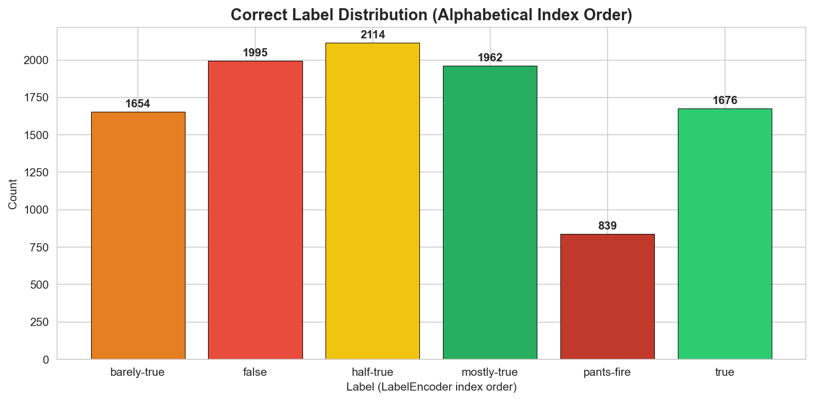

3. Label Encoding
=================

The project uses scikit-learn's ``LabelEncoder`` to convert string labels to
integer indices.

.. danger:: Label Display Bug in Notebook 01

   ``LabelEncoder`` sorts labels **alphabetically**, not in the order they
   are passed to ``fit()``.

   ``DataProcessor.TRUTHFULNESS_LABELS`` lists:
   ``[true, mostly-true, half-true, barely-true, false, pants-fire]``

   But ``LabelEncoder.classes_`` produces:
   ``[barely-true, false, half-true, mostly-true, pants-fire, true]``

   Notebook 01 displays ``0 (true): 1654`` -- this is **WRONG**.
   Index 0 is ``barely-true``, and 1654 is the count for barely-true.

Encoding Code
-------------

.. code-block:: python

   from sklearn.preprocessing import LabelEncoder

   le = LabelEncoder()
   le.fit(['true', 'mostly-true', 'half-true', 'barely-true', 'false', 'pants-fire'])

Intermediate Output -- Encoding Results
~~~~~~~~~~~~~~~~~~~~~~~~~~~~~~~~~~~~~~~~

.. code-block:: text

   LabelEncoder.classes_ (actual order): ['barely-true', 'false', 'half-true',
                                           'mostly-true', 'pants-fire', 'true']

   Encoding:
     'true'         -> index 5
     'mostly-true'  -> index 3
     'half-true'    -> index 2
     'barely-true'  -> index 0
     'false'        -> index 1
     'pants-fire'   -> index 4

Intermediate Output -- Correct Label Distribution
~~~~~~~~~~~~~~~~~~~~~~~~~~~~~~~~~~~~~~~~~~~~~~~~~~

.. code-block:: text

   Index 0 -> barely-true:    1654 (16.2%)  ################################
   Index 1 -> false:          1995 (19.5%)  #######################################
   Index 2 -> half-true:      2114 (20.6%)  #########################################
   Index 3 -> mostly-true:    1962 (19.2%)  ######################################
   Index 4 -> pants-fire:      839 ( 8.2%)  ################
   Index 5 -> true:           1676 (16.4%)  ################################

Config.py Verification
----------------------

.. code-block:: text

   config.py TRUTHFULNESS_LABELS dict:
     0 -> 'barely-true'  (LabelEncoder: 'barely-true')  [OK]
     1 -> 'false'        (LabelEncoder: 'false')        [OK]
     2 -> 'half-true'    (LabelEncoder: 'half-true')    [OK]
     3 -> 'mostly-true'  (LabelEncoder: 'mostly-true')  [OK]
     4 -> 'pants-fire'   (LabelEncoder: 'pants-fire')   [OK]
     5 -> 'true'         (LabelEncoder: 'true')         [OK]

``config.py`` uses alphabetical order and is **correct**. The bug is only in
``DataProcessor.TRUTHFULNESS_LABELS`` list order vs ``LabelEncoder`` behavior.

.. admonition:: Alternative -- Ordinal Regression

   These labels have a **natural order** on a truthfulness spectrum:

   ``true(5) > mostly-true(4) > half-true(3) > barely-true(2) > false(1) > pants-fire(0)``

   Standard cross-entropy treats all misclassifications equally -- predicting
   ``true`` for a ``pants-fire`` statement is penalized the same as predicting
   ``mostly-true`` for a ``true`` statement.

   **Option 1: Ordinal Cross-Entropy Loss**

   .. code-block:: python

      def ordinal_loss(logits, targets, num_classes=6):
          ce = F.cross_entropy(logits, targets, reduction='none')
          preds = logits.argmax(dim=1)
          distance = torch.abs(preds.float() - targets.float())
          return (ce * (1 + 0.5 * distance)).mean()

   **Option 2: Collapse to 3 classes** (simpler, higher accuracy):

   .. code-block:: text

      true + mostly-true       -> TRUE
      half-true                -> MIXED
      barely-true + false + pants-fire -> FALSE

   Expected accuracy: **80%+** and more practically useful.
