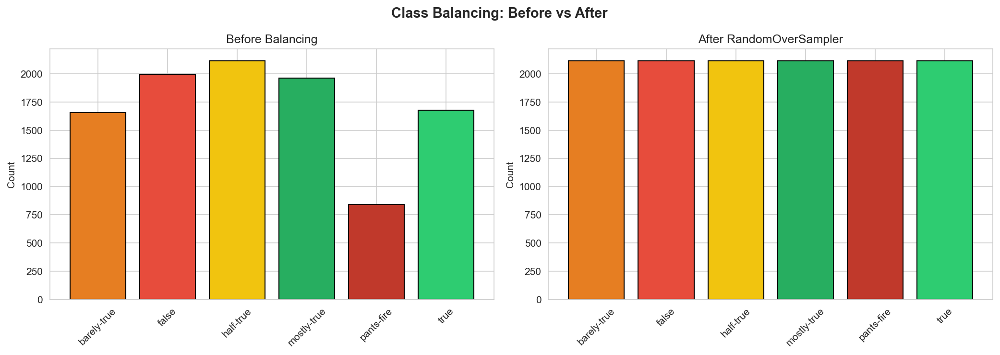

5. Class Balancing
==================

The dataset has moderate class imbalance (2.52:1 ratio). The project uses
``RandomOverSampler`` from imbalanced-learn to duplicate minority class samples.

Balancing Code
--------------

.. code-block:: python

   from models import ClassBalancer

   balancer = ClassBalancer()
   X_balanced, y_balanced = balancer.oversample_minority(X, y)

Intermediate Output -- Before Balancing
~~~~~~~~~~~~~~~~~~~~~~~~~~~~~~~~~~~~~~~~

.. code-block:: text

   barely-true:    1654 (16.2%)  ################################
   false:          1995 (19.5%)  #######################################
   half-true:      2114 (20.6%)  #########################################
   mostly-true:    1962 (19.2%)  ######################################
   pants-fire:      839 ( 8.2%)  ################
   true:           1676 (16.4%)  ################################
   Total: 10,240

Intermediate Output -- After RandomOverSampler
~~~~~~~~~~~~~~~~~~~~~~~~~~~~~~~~~~~~~~~~~~~~~~~

.. code-block:: text

   barely-true:    2114 (16.7%)
   false:          2114 (16.7%)
   half-true:      2114 (16.7%)
   mostly-true:    2114 (16.7%)
   pants-fire:     2114 (16.7%)
   true:           2114 (16.7%)
   Total: 12,684 (added 2,444 duplicate samples)

Class Weights (Computed but Unused)
-----------------------------------

.. code-block:: python

   class_weights = balancer.compute_class_weights(y, num_classes=6)

.. code-block:: text

   barely-true:    1.0317
   false:          0.8555
   half-true:      0.8074   (lowest weight -- largest class)
   mostly-true:    0.8700
   pants-fire:     2.0340   (highest weight -- smallest class)
   true:           1.0183

.. note::

   These weights are computed in notebook 02 but **never passed** to the
   Tinker training loss function. Using them could improve performance on
   the minority class (pants-fire).

.. admonition:: Alternatives -- Better Balancing

   **1. Class-weighted loss** (simplest, no data duplication):

   .. code-block:: python

      loss = F.cross_entropy(logits, targets, weight=class_weights_tensor)

   **2. Focal loss** (handles easy vs hard examples):

   .. code-block:: python

      def focal_loss(logits, targets, gamma=2.0):
          ce = F.cross_entropy(logits, targets, reduction='none')
          pt = torch.exp(-ce)
          return ((1 - pt) ** gamma * ce).mean()

   Paper: `Focal Loss (Lin et al. 2017) <https://arxiv.org/abs/1708.02002>`_

   **3. Data augmentation** (generate new diverse samples):

   .. code-block:: python

      import nlpaug.augmenter.word as naw
      aug = naw.SynonymAug(aug_src='wordnet')
      augmented = aug.augment(text)

   GitHub: https://github.com/makcedward/nlpaug
