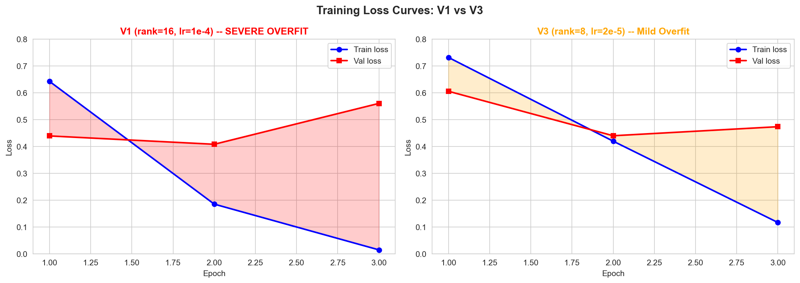

8. Training Results
===================

Results Summary
---------------

.. list-table::
   :header-rows: 1
   :widths: 15 15 15 20 20

   * - Version
     - Test Accuracy
     - Macro F1
     - Final Train Loss
     - Final Val Loss
   * - V1 (rank=16)
     - 71.90%
     - 0.7203
     - 0.0150
     - 0.5607
   * - **V3 (rank=8)**
     - **71.59%**
     - **0.7171**
     - **0.1170**
     - **0.4738**

Loss Curves
-----------

Intermediate Output -- V1 (SEVERE Overfit)
~~~~~~~~~~~~~~~~~~~~~~~~~~~~~~~~~~~~~~~~~~~

.. code-block:: text

   Epoch 1: train_loss=0.6426, val_loss=0.4395, gap=-0.2031
   Epoch 2: train_loss=0.1854, val_loss=0.4084, gap=+0.2230
   Epoch 3: train_loss=0.0150, val_loss=0.5607, gap=+0.5457  <-- SEVERE OVERFIT

   Train loss dropped 43x while val loss INCREASED 28%.

Intermediate Output -- V3 (Mild Overfit)
~~~~~~~~~~~~~~~~~~~~~~~~~~~~~~~~~~~~~~~~~

.. code-block:: text

   Epoch 1: train_loss=0.7319, val_loss=0.6058
   Epoch 2: train_loss=0.4199, val_loss=0.4402
   Epoch 3: train_loss=0.1170, val_loss=0.4738  <-- val increasing (mild overfit)

   Best checkpoint would be at epoch 2 (val_loss = 0.440).

Confusion Matrix Analysis (V3)
-------------------------------

.. code-block:: text

   Predicted ->    barely  false  half  mostly  pants  true
   True label:
   barely-true:     196     34    27     26      3      6    (67.1% correct)
   false:            24    211    28     37      7      7    (67.2% correct)
   half-true:        33     21   192     61      0      6    (61.3% correct)
   mostly-true:      14     16    29    247      1     13    (77.2% correct)
   pants-fire:        9     21     8      8    293      0    (86.4% correct)
   true:             12     11    24     55      0    224    (68.7% correct)

Per-Class Metrics (V3)
~~~~~~~~~~~~~~~~~~~~~~

.. list-table::
   :header-rows: 1
   :widths: 20 15 15 15 15

   * - Label
     - Precision
     - Recall
     - F1-Score
     - Support
   * - barely-true
     - 0.681
     - 0.671
     - 0.676
     - 292
   * - false
     - 0.672
     - 0.672
     - 0.672
     - 314
   * - half-true
     - 0.623
     - 0.613
     - 0.618
     - 313
   * - mostly-true
     - 0.569
     - 0.772
     - 0.655
     - 320
   * - **pants-fire**
     - **0.964**
     - **0.864**
     - **0.911**
     - 339
   * - true
     - 0.875
     - 0.687
     - 0.770
     - 326

Key Findings:

- **pants-fire** has highest accuracy (86.4%) -- extreme claims are easiest
- **half-true** has lowest accuracy (61.3%) -- middle ground is hardest
- Adjacent labels on the truthfulness spectrum are most confused
- half-true often confused with mostly-true (61 cases)
- true often confused with mostly-true (55 cases)

Most Confused Label Pairs
~~~~~~~~~~~~~~~~~~~~~~~~~

.. code-block:: text

   Top 10 confusion pairs:
     half-true       -> mostly-true:    61 times
     true            -> mostly-true:    55 times
     false           -> mostly-true:    37 times
     barely-true     -> false:          34 times
     half-true       -> barely-true:    33 times
     mostly-true     -> half-true:      29 times
     false           -> half-true:      28 times
     barely-true     -> half-true:      27 times
     barely-true     -> mostly-true:    26 times
     true            -> half-true:      24 times

   Pattern: Most confusions occur between ADJACENT labels.
   This strongly supports ordinal loss approaches.

Overfitting Analysis
--------------------

**V1 Root Causes:**

1. Learning rate ``1e-4`` is too high for LoRA
2. Rank 16 = too many trainable parameters -> memorization
3. No learning rate scheduling or warmup
4. No early stopping

**V3 Improvement:**

- Reduced rank (16 -> 8): fewer trainable parameters
- Reduced LR (1e-4 -> 2e-5): 5x smaller updates
- Much better val loss (0.474 vs 0.561)

.. admonition:: Alternatives -- Better Training

   **1. Early stopping** (most impactful):

   .. code-block:: python

      best_val_loss = float('inf')
      patience_counter = 0
      for epoch in range(max_epochs):
          val_loss = evaluate(...)
          if val_loss < best_val_loss:
              best_val_loss = val_loss
              save_checkpoint()
              patience_counter = 0
          else:
              patience_counter += 1
              if patience_counter >= 2:
                  break
      load_checkpoint()  # restore best

   **2. Learning rate scheduling** (cosine with warmup):

   .. code-block:: python

      warmup_steps = int(0.1 * total_steps)
      for step in range(total_steps):
          if step < warmup_steps:
              lr = base_lr * step / warmup_steps
          else:
              progress = (step - warmup_steps) / (total_steps - warmup_steps)
              lr = base_lr * 0.5 * (1 + math.cos(math.pi * progress))

   **3. Optuna hyperparameter search**:

   .. code-block:: python

      import optuna
      def objective(trial):
          lr = trial.suggest_float('lr', 1e-6, 1e-4, log=True)
          rank = trial.suggest_categorical('rank', [4, 8, 16, 32])
          # ... train and return val_loss
      study = optuna.create_study(direction='minimize')
      study.optimize(objective, n_trials=20)

   Docs: https://optuna.readthedocs.io/
